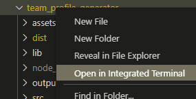
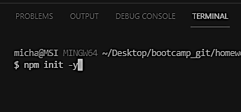
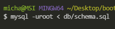
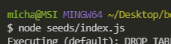
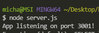

# E-Commerce Back End Application

## Description

This is a back-end e-commerce application that stores an assortment of products and details contained in numerous tables within a single database. These products are associated with their details using through models.

## Table of Contents

* [Installation](#Install)
* [Usage](#Usage-Instructions)
* [Contribution](#Contribution-Guidelines)
* [Test](#Test-Instructions)
* [License](#License)

## Installation

Must have Node installed as well as npm dependencies include Express, MySQL2, Sequelize, and dotenv. Can also connect to a graphical user interface tool such as MySQL Workbench to edit database. Will also be using the API platform Insomnia.

## Usage Instructions

### Open Directory in Integrated Terminal

### run npm install. Make sure you have express, mysql2, sequelize and dotenv dependencies

### Run mysql to connect to database. Include password, if needed, with "mysql -uroot < db/schema.sql"

### Run "node seeds/index.js" to seed database in Terminal

### Run "node server.js" to start server

### Using Insomnia, check the RESTful CRUD Operations

## Contribution Guidelines

Several tutor sessions.

## Test Instructions

not applicable at this time

## License

not applicable

## Contact

* Github Username: mpagenkopf

* Email: pagenkopf.edit@gmail.com

* Link to Repository: [Repository](https://github.com/mjpagenkopf/ecommerce_back_end)

* Link to Screencastify video: [Screencastify](https://drive.google.com/file/d/1MOLt-ObciLFg9zFNVDJsUsPvmU15pUS2/view)